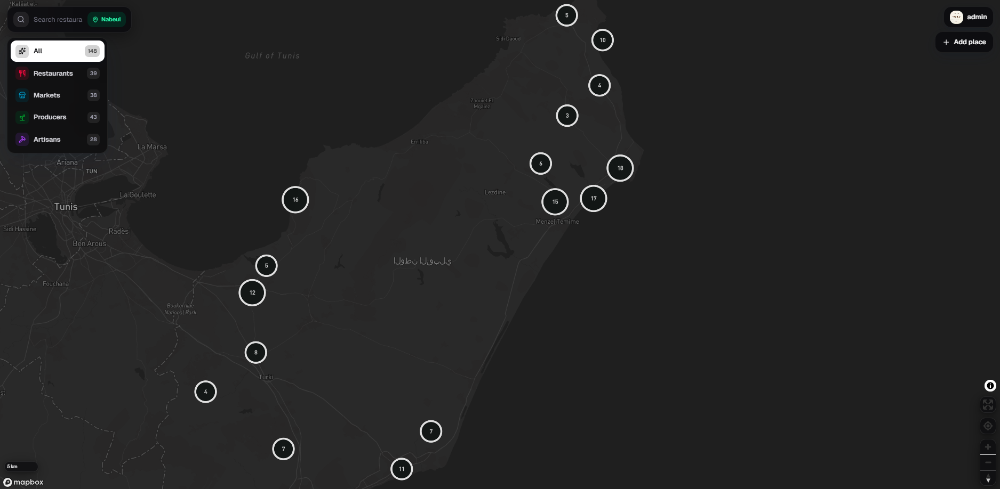

# Interactive Tunisia Map



Interactive Tunisia Map is a premium Mapbox-powered discovery platform for Tunisia, starting with Nabeul. It combines a fast interactive map, MongoDB-backed places, ratings, reviews, user profiles, image uploads, and an admin approval workflow for community-submitted locations.

## Features

- Interactive Mapbox map focused on Nabeul, Tunisia
- MongoDB places for hotels, restaurants, cafes, attractions, shopping, beaches, and more
- Clustered place markers with category-specific icons and selected states
- Vertical category filters and API-backed autocomplete search
- Place detail panel with image gallery, ratings, comments, and directions
- User authentication with public profiles and contribution stats
- Add-place flow directly from the map by selecting a point
- Pending place requests with admin approval/rejection
- ImgBB image uploads for profile photos and place photos
- Locked Tunisia regions shown as coming soon when zoomed out
- Responsive light/dark UI with frosted map controls

## Tech Stack

- Next.js 16 App Router
- React 19
- TypeScript
- Tailwind CSS
- Mapbox GL JS
- MongoDB
- ImgBB uploads

## Getting Started

Install dependencies:

```bash
npm install
```

Create `.env` from `.env.example` and fill in your local values:

```bash
cp .env.example .env
```

Required environment variables:

```env
NEXT_PUBLIC_MAPBOX_TOKEN=
NEXT_PUBLIC_DEFAULT_REGION=Nabeul
MONGODB_URI=
MONGODB_DB=
MONGODB_PLACES_COLLECTION=places
MONGODB_REVIEWS_COLLECTION=reviews
MONGODB_USERS_COLLECTION=users
MONGODB_SESSIONS_COLLECTION=sessions
MONGODB_PLACE_REQUESTS_COLLECTION=placeRequests
ADMIN_EMAIL=
IMGBB_API_KEY=
```

Run the development server:

```bash
npm run dev
```

Open [http://localhost:3000](http://localhost:3000).

## Admin Workflow

Set `ADMIN_EMAIL` to the email address of the account that should approve places. When that user signs in, the app syncs the role to `admin`.

Admin moderation is available at:

```text
/admin/places
```

Approved places are inserted into the public `places` collection and appear on the map.

## Useful Scripts

```bash
npm run dev
npm run build
npm run lint
npm run db:seed:capbon
```

